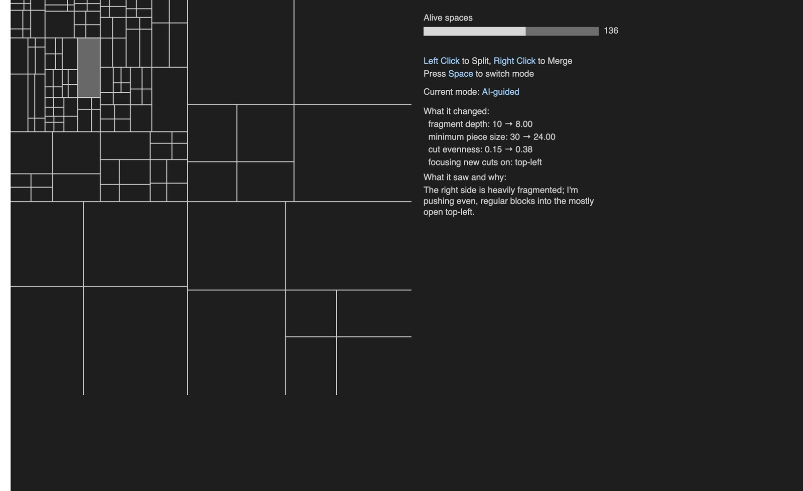
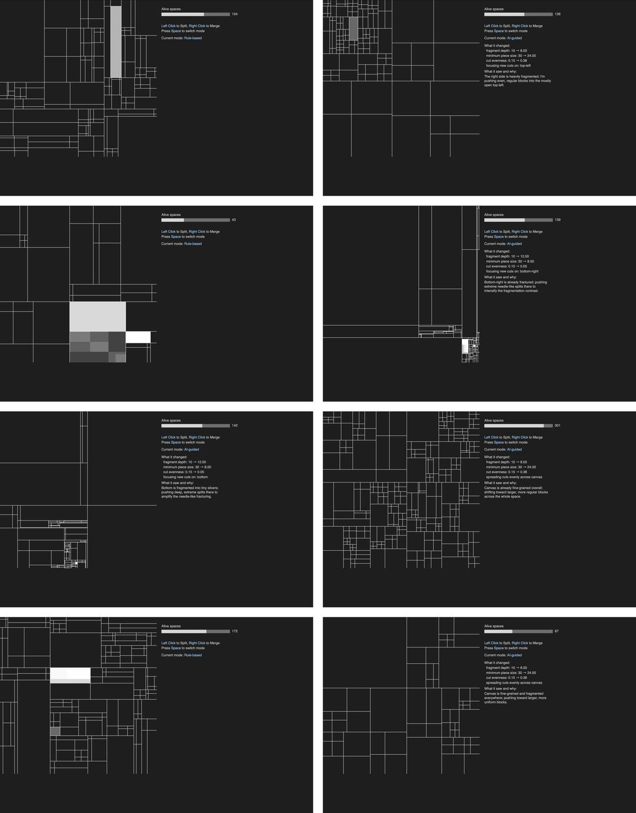

# Co-Authored / Unauthored

*An LLM-guided generative quadtree.* A canvas keeps subdividing and collapsing itself under a fixed set of rules. You can intervene by clicking. And at any moment a language model can be asked to look at the current structure, decide how the canvas should fragment next, and explain its choice in one sentence you can verify by watching.

**Live: https://visionary-machines.vercel.app**



The work aims to question where creativity actually lives: in the hand that intervenes directly? in the architecture of rules that leaves room for surprise? in a model that reads, intends and explains? — Or in the whole trace of control changing hands, never resolved, never quite anyone's?

---

## What it is

A quadtree runs continuously: it picks a live space, cuts it into four with one vertical and one horizontal line, and elsewhere merges four siblings back into their parent. Split and merge weights drift over time, so the canvas never settles — it thickens, thins out, occasionally empties completely and starts again.

Two things can intervene in that process:

- **You**, by clicking — left click splits the space under the cursor, right click merges it back.
- **A language model**, by pressing space — it reads the structure and re-tunes the *character* of every future cut.

## The design problem: human vs AI autonomy

Most of the work in this piece went into deciding what the model is *not* allowed to do.

- **The rhythm is not negotiable.** Split-versus-merge pacing, merge depth bias, and the weight transition curve stay under the rule-based system. The model controls texture, not tempo.
- **Every returned number is clamped.** Each parameter has a declared safe range, and the model's output is constrained into it before use. 
- **Making the decision legible.** The panel on the right shows the current mode. When the model intervene, it states what the model saw, what it changed, and one-sentence reason. A viewer who has never seen the code can read the sentence, look at the canvas, and check whether it was true.



*Eight frames alternating between rule-based and AI-guided mode from a single run.*

## Controls

| Input | Effect |
|---|---|
| Left click | Split the space under the cursor |
| Right click | Merge that space back into its parent |
| Space | Ask the model for a new decision |
| Space again | Drop the model's decision, return to system defaults |

## Architecture

```
index.html           p5.js canvas
sketch-quadtree.js   quadtree, rendering, interaction, prompt construction, clamping
api/ai-decide.js     Vercel serverless function — holds the API key, proxies to Claude
```

The browser never holds an API key. The frontend posts a prompt to the backend; the backend attaches the key and forwards it to the Claude API (`claude-haiku-4-5`).

## Stack

p5.js · vanilla JavaScript · Node.js · Vercel serverless functions · Claude API

## License

© 2026 Beta HSU Yun Chu. All rights reserved. Readable and forkable on GitHub for reference; not licensed for reuse, modification, or distribution. Ask me if you want to use any of it.
